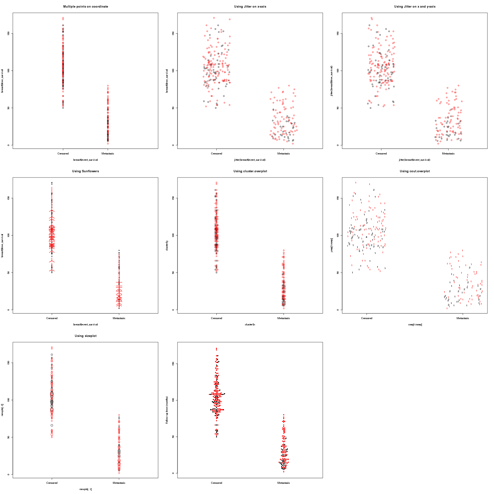

# Dot Histgram
在之前的一节当中，图型名称有些混乱，从这一节开始将做如下统一（不全面）：

英文名称| 中文名称
-----|-----
bar| 条形图
line| 线图
area| 面积图
pie| 饼图
high-low| 高低图
pareto| 帕累托图
control| 控制图
boxplot| 箱线图
error bar| 误差条图
scatter| 散点图
P-P| P-P正态概率图
Q-Q| Q-Q正态概率图
sequence| 序列图
ROC Curve| ROC分类效果曲线图
Time Series| 时间序列图

好了，言归正传。那么什么又是点柱图(dot histogram)呢？之前我又称之为蜂群图(beeswarm)。还有称之为抖点图(jitter plots)。

## beeswarm
```{r beeswarm}
plot.new()
library(beeswarm)
data(breast)
head(breast)
library(plotrix)
cluster <- cluster.overplot(breast$event_survival, breast$time_survival)
png("dothist.png",width=1500,height=1500)
opar<-par(mfrow=c(3,3))
plot (breast$event_survival, breast$time_survival, main="Multiple points on coordinate",col=as.numeric(breast$ER),xaxt="n",xlim=c(-1,2))
axis(1,at=c(0,1),labels=c("Censored","Metastasis"))
plot(jitter(breast$event_survival), breast$time_survival, main="Using Jitter on x-axis",col=as.numeric(breast$ER),xaxt="n",xlim=c(-0.5,1.5))
axis(1,at=c(0,1),labels=c("Censored","Metastasis"))
plot(jitter(breast$event_survival), jitter(breast$time_survival), main="Using Jitter on x and y-axis",col=as.numeric(breast$ER),xaxt="n",xlim=c(-0.5,1.5))
axis(1,at=c(0,1),labels=c("Censored","Metastasis"))
sunflowerplot(breast$event_survival, breast$time_survival, main="Using Sunflowers",xaxt="n",xlim=c(-0.5,1.5))
axis(1,at=c(0,1),labels=c("Censored","Metastasis"))
plot(cluster, main="Using cluster.overplot",col=as.numeric(breast$ER),xaxt="n",xlim=c(-0.5,1.5))
axis(1,at=c(0,1),labels=c("Censored","Metastasis"))
count.overplot(jitter(breast$event_survival), jitter(breast$time_survival), main="Using cout.overplot",col=as.numeric(breast$ER),xaxt="n")
axis(1,at=c(0,1),labels=c("Censored","Metastasis"))
sizeplot(breast$event_survival, breast$time_survival, main="Using sizeplot",col=as.numeric(breast$ER),xaxt="n",xlim=c(-0.5,1.5))
axis(1,at=c(0,1),labels=c("Censored","Metastasis"))
beeswarm(time_survival ~ event_survival, data = breast,
         method = 'swarm',
         pch = 16, pwcol = as.numeric(ER),
         xlab = '', ylab = 'Follow-up time (months)',
         labels = c('Censored', 'Metastasis'))
dev.off()
par(opar)
```


以下是解释

在很多情况下，我们画散点图的时候，有许多点拥有相同的横坐标，如果我们简单的使用plot(x,y)的方式，会显得这些点拥挤在一起，象图中左上角一样，非常的不舒服。我们需要把这些点分散开。

最基本的思路是，把横坐标抖散(jitter)，使本来都拥有相同坐标的点的横坐标稍有不同。jitter是基类函数{base}，无需调用任何包。

```{}
plot(jitter(breast$event_survival), breast$time_survival, main="Using Jitter on x-axis",col=as.numeric(breast$ER),xaxt="n",xlim=c(-0.5,1.5))
axis(1,at=c(0,1),labels=c("Censored","Metastasis"))
plot(jitter(breast$event_survival), jitter(breast$time_survival), main="Using Jitter on x and y-axis",col=as.numeric(breast$ER),xaxt="n",xlim=c(-0.5,1.5))
axis(1,at=c(0,1),labels=c("Censored","Metastasis"))
```

我们比较图中上边靠右的两个图，我们发现，如果只抖散x坐标的话，还是有些点会粘在一起，所以同时抖散y坐标会好一些。我们可以使用factor参数来控制jitter抖散的强度。

## jitter
```{r jitter}
plot(rep(c(1,5,10),each=5),c(jitter(rep(100,5),factor=1),jitter(rep(100,5),factor=5),jitter(rep(100,5),factor=10)),col=c("red","blue","green","gray","black"),xlim=c(-2,13),xlab="",ylab="y",xaxt="n",main="jitter(rep(100,5)) with different factor")
axis(1,at=c(1,5,10),labels=c(paste("factor=",c(1,5,10),sep="")))
```

在graphics包中提供了一个sunflowerplot的函数。它的目的是用花瓣数目多少来显示落在同一坐标上的点的数目。但是从中左图看来，点多的时候效果并非总是那么好。

在plotrix包中提供了一些有意思的函数来解决点挤在一起的这个问题，它们分别是cluster.overplot, count.overplot, sizeplot。这三个函数的效果如图中及下靠左的两个。cluster.overplot的方法类似抖散，count overplot的方法是使用数字来显示落在同一坐标上的点的数目，sizeplot的方法是使用不同大小是点来显示落在同一坐标上的点的数目。从效果来看，点多的时候效果也并非理想。

而上一次提到过的蜂群图似乎是解决这一问题的最佳方案。

我们得出结论，在点数不同的情况下，使用plotrix包及sunflowerplot是不错的。但点数较多的情况下，还是使用jitter和beeswarm较为稳妥。

我们也可以使用ggplot2包中的geom来绘制点柱图

## ggplot2
```{r ggolot2}
require(beeswarm)
data(breast)
library(ggplot2)
p<-ggplot(breast, aes(event_survival,time_survival))
print(p+geom_jitter(aes(color=ER))+scale_colour_manual(values = c("black", "red"))+scale_x_continuous(breaks = c(0:1),labels = c("Censored", "Metastasis")))

```

还有一种图，名称为Engelmann-Hecker-Plot， 由plotrix的ehplot来实现。

## EH
```{r Engelmann-Hecker-Plot}
data(iris)
library(plotrix)
ehplot(iris$Sepal.Length, iris$Species,intervals=20, cex=1.8, pch=20, main="pch=20")
ehplot(iris$Sepal.Width, iris$Species,intervals=20, box=TRUE, median=FALSE, main="box=TRUE")
ehplot(iris$Petal.Length, iris$Species,pch=17, col="red", log=TRUE, main="pch=17")
ehplot(iris$Petal.Length, iris$Species,offset=0.06, pch=as.numeric(iris$Species),main="pch=as.numeric(iris$Species)")
rnd <- sample(150)
plen <- iris$Petal.Length[rnd]
pwid <- abs(rnorm(150, 1.2))
spec <- iris$Species[rnd]
ehplot(plen, spec, pch=19, cex=pwid, col=rainbow(3, alpha=0.6)[as.numeric(spec)], main="cex and col changes")
```

