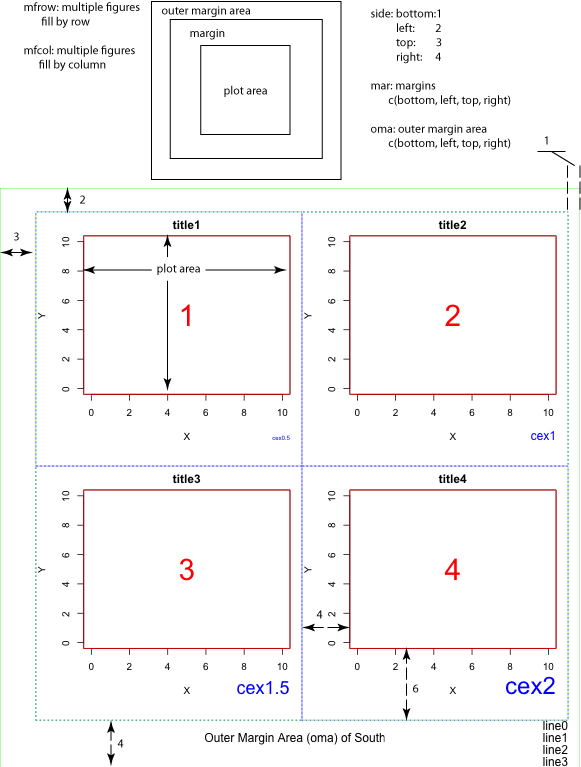

```{r setup, include=FALSE}
knitr::opts_chunk$set(echo = TRUE)
```
# R 画图基础
## 1. 布局
Ｒ绘图所占的区域，被分成两大部分，一是外围边距，一是绘图区域。

外围边距可使用par()函数中的oma来进行设置。比如oma=c(4,3,2,1)，就是指外围边距分别为下边距：4行，左边距3行，上边距2行，右边距1行。很明显这个设置顺序是从x轴开始顺时针方向。这里的行是指可以显示1行普通字体。所以当我们使用mtext中的line参数时，设置的大小就应该是[0,行数)的开区间。当我们使用mtext在外围边距上书写内容时，设置mtext中的outer=TRUE即可。

绘图区域可使用par()函数中的mfrow,mfcol来进行布局。mfrow和mfcol可以使用绘图区域被区分为多个区域。默认值为mfrow(1,1)。

比如mfrow(2,3)就是指将绘图区域分成2行3列，并按行的顺序依次绘图填充；
比如mfcol(3,2)就是指将绘图区域分成3行2列，并按列的顺序依次绘图填充；

我们将每一个细分的绘图区域分为两个部分，一是绘图边距，一是主绘图。

绘图边距需要容纳的内容有坐标轴，坐标轴标签，标题。通常来讲，我们都只需要一个x轴，一个y轴，所以在设置时，一般的下边距和左边距都会大一些。如果多个x轴或者y轴，才考虑将上边距或者右边距放大一些。绘图边距可以使用par()函数中mar来设置。比如mar=c(4,3,2,1)，与外围边距的设置类似，是指绘图边距分别为下边距：4行，左边距3行，上边距2行，右边距1行。很明显这个设置顺序是从x轴开始顺时针方向。行的概念与之前的相同。也可以使用mai来设置。mai与mar唯一不同之处在于mai不是以行为单位，而是以inch为单位。

```{r mfrow_and_box, eval=FALSE}
SOUTH<-1; WEST<-2; NORTH<-3; EAST<-4;

GenericFigure <- function(ID, size1, size2){
    plot(0:10, 0:10, type="n", xlab="X", ylab="Y") #plot type set "n" is no plotting
    text(5,5, ID, col="red", cex=size1)
    box("plot", col="red")
    mtext(paste("cex",size2,sep=""), SOUTH, line=3, adj=1.0, cex=size2, col="blue") # Write text into the margins of plot
    title(paste("title",ID,sep=""))
}

MultipleFigures <- function(){
    GenericFigure("1", 3, 0.5)
    box("figure", lty="dotted", col="blue")
 
    GenericFigure("2", 3, 1)
    box("figure", lty="dotted", col="blue")
    
    GenericFigure("3", 3, 1.5)
    box("figure", lty="dotted", col="blue")
 
    GenericFigure("4", 3, 2)
    box("figure", lty="dotted", col="blue")
}

# Set plot area as 2x2 figures; plot margin 6,4,2,1 for bottom, left, top, right in figure; plot area outer margin 6,4,2,1
par(mfrow=c(2,2),mar=c(6,4,2,1),oma=c(6,4,2,1))

MultipleFigures()

# make concept clear about outer, inner(plot area), figure, plot
# outer is the canvas of device, contains inner and oma(outer margin)
# inner is the drawing area
# figure contains plot and text in plot margin 
# plot is the box in the axis
box("inner", lty="dotted", col="green")
box("outer", lty="dotted", col="green")

# Specify write text in the outer margin area
mtext("Outer Margin Area (oma) of South: 6", SOUTH, line=1, cex = 1, outer=TRUE)

plotline<-function(n,direc){
    for(i in 0:n){
        mtext(paste("line",i,sep=""), direc, line=i, cex=1, col="black", adj=1, outer=TRUE)
        }
}

plotline(6,SOUTH)
```


但是，使用mfrow,mfcol只能是矩阵似的布局，如果我们需要简单地实际不规则的布局，那该怎么办呢？还有强大的layout()专门用于布局。

`layout(mat, widths = rep(1, ncol(mat)), heights = rep(1,nrow(mat)),respect = FALSE)`

其中，mat就是一个距阵，假设我们要画N个图，那么，mat就要描述每个图所在的位置，其中1…N-1都必须至少出现过一次。

比如有三个图，我们希望的布局是第一排有一个图，第二排有两个图，那么`mat<-matrix(c(1,1,2,3), nrow=2, ncol=2, byrow = TRUE)`

如果希望第一排有两个图，第二排有一个图，那么就是`mat<-matrix(c(1,2,3,3),nrow=2,ncol=2,byrow=TRUE)`。

很明显，还是将画布分成许多小格矩阵，这里就是2Ｘ2的，如果希望第1个图放入第一排的1，2格，那就在矩阵的第1，2的位置写入1，如果是希望第2个图放在第一排的1，2格，那就在矩阵的第1，2的位置写入2。

```{r use_layout1, eval=TRUE}
attach(mtcars)
layout(matrix(c(1,1,2,3), 2, 2, byrow = TRUE))
hist(wt)
hist(mpg)
hist(disp)
```
那么参数中的widths和heights又是做什么用的呢？它们就是用来指定每行或者每列的宽度和高度的。我们可以做以下的比较：
```{r use_layout2, eval=TRUE}
layout(matrix(c(1,1,1,1,2,2,2,3,2,2,2,3),3,4,byrow=TRUE))
hist(wt)
hist(mpg)
hist(disp)
```
```{r use_layout3, eval=TRUE}
layout(matrix(c(1,1,2,3), 2, 2, byrow = TRUE),widths=c(3,1), heights=c(1,2))
hist(wt)
hist(mpg)
hist(disp)
```
我们发现，这两种方法得到的是相同的结果，在代码的书写上，第2种方法要更清晰一些。

想象一下，似乎每个图的位置必须是连在一起的小矩阵，如果，不构成连在一起小矩阵，会成为怎么样的一个结果呢？
```{r use_layout4}
layout(matrix(c(1,1,2,1,1,1),nrow=2,ncol=3,byrow=T))
hist(wt)
hist(mpg)
```

如果需要大图，小图，内嵌图这`layout()`虽然很容易实现，但多少有点麻烦，不是那么随心所欲。还是回过头来使用`par()`吧。

使用`par()`的中`fig=在画布任意位置上画图`。在使用fig参数时，需要把画布理解成左下角为坐标(0,0)，右上角为(1,1)的一个坐标系。`fig=c(x1,x2,y1,y2)`来设置该参，`x1<x2`,`y1<y2`，`x1`,`y1`定位绘图区的左下角，`x2`,`y2`定位绘图区的右上角。使用`new=TRUE`参数来确认是否在原画布上继续画，还重新在一张新画布上开始画。

```{r use_par_fig}
par(fig=c(0,0.85,0,0.85), new=F)
plot(mtcars$wt, mtcars$mpg, xlab="Miles Per Gallon",ylab="Car Weight")
par(fig=c(0,0.8,0.55,1), new=TRUE)
boxplot(mtcars$wt, horizontal=TRUE, axes=FALSE)
par(fig=c(0.65,1,0,0.8),new=TRUE)
boxplot(mtcars$mpg, axes=FALSE)
mtext("Enhanced Scatterplot", side=3, outer=TRUE, line=-3)
par(fig=c(0.4,0.75,0.4,0.7),new=TRUE,mar=c(2,2,0,0),mgp=c(1,.4,0),cex=1,cex.lab=0.7,cex.axis=0.7)
hist(mtcars$mpg, main="")
```

## 2. 颜色
计算机保存及还原颜色时有多种方案，较为常用的是两个，RGB和HSV。R预设了657种颜色，可以通过colors()函数调用（或者英式拼写colours()）。比如我们常用的红，绿，蓝。

```{r color1}
colors()[c(552,254,26)]
```

我们可以使用grep来调取我们感兴趣的颜色
```{r color2}
grep("red",colors())
colors()[grep("red",colors())]
colors()[grep("sky",colors())]
SetTextContrastColor <- function(color){
    ifelse(mean(col2rgb(color)) > 127, "black", "white")
}
TextContrastColor <- unlist(lapply(colors(), SetTextContrastColor))
colCount <- 25
rowCount <- 27
plot(c(1,colCount), c(0,rowCount), type="n", ylab="", xlab="", axes=FALSE, ylim=c(rowCount,0))
title("R colors")
for (j in 0:(rowCount-1)){
    base <- j*colCount
    remaining <- length(colors()) - base
    RowSize <- ifelse(remaining < colCount, remaining, colCount)
    rect((1:RowSize)-0.5,j-0.5, (1:RowSize)+0.5,j+0.5,border="black", col=colors()[base + (1:RowSize)])
    text((1:RowSize), j, paste(base + (1:RowSize)), cex=0.7, col=TextContrastColor[base + (1:RowSize)])
}
```

对于大多数理工出身的人来讲，理解颜色并不难，难的是如何选择一种或者多种理想的颜色，让绘图很漂亮。Ｒ当中有一个包`RColorBrewer`就可以为我们解决这个难题，其中预设了很多种颜色组合以供我们使用。

```{r RcolorBrewer}
library(RColorBrewer)
display.brewer.all()
```

我们看到其中Set3和Paired设定了12种颜色，其余的有多有少，以9种居多。在使用其颜色时，使用`brewer.pal(n, name)`调用即可，其中n最小值为3最大值为每组预设值数组的长度。比如`brewer.pal(12,Paired)`

在绘图时，有如下颜色参数

参数|	描述
-----|------
col	|绘图使用的颜色，许多函数接受一组颜色，并对不同的数据依次使用颜色。
col.axis|	坐标轴字符颜色
col.lab|	x,y坐标标记颜色
col.main|	标题颜色
col.sub|	副标题颜色
fg|	绘图前景色，包括坐标轴，各类boxes
bg|	绘图背景色


```{r color3}
require(graphics)
par(col.axis="green",col.lab="blue",col.main="darkred",fg="white",bg="black")
plot(cars,main="speed vs dist")
```

## 3. 字体
字体参数如下

参数|描述
------|------
font|字体描述，1正常，2加粗，3斜体，4加粗，斜体，5符号
font.axis|坐标轴字符描述
font.lab|坐标轴标记字体描述
font.main|标题字体描述
font.sub|副标题字体描述
ps|字体点阵大小，大约为1\/72英寸。在使用时text size=ps\*cex
cex|字体放大或者缩小多少倍
cex.axis|坐标轴字符大小
cex.lab|坐标轴标记字体大小
cex.main|标题字体大小
cex.sub|副标题字体大小  

```{r font}
fonts<-names(pdfFonts())
cnt<-length(fonts)
x<-cnt+10
x<-1:x
y<-x
pdf("font.pdf")
plot(x,y,type="n")
for(i in 1:cnt){text(i,i*1.3,family=fonts[i],paste("font",fonts[i]),adj=0)}
```


## 4. 符号与线形
画图中的符号由pch参数来控制。其描边色由col控制，填充色由bg控制。

```{r symbol_and_line_type}
pchShow <-function(extras = c("*",".", "o","O","0","+","-","|","%","#"),
	cex = 3, ## good for both .Device=="postscript" and "x11"
	col = "red3", bg = "gold", coltext = "brown", cextext = 1.2,
	main = paste("plot symbols :  points (...  pch = *, cex =",cex,")")){
	 nex <- length(extras)
	 np  <- 26 + nex
	 ipch <- 0:(np-1)
	 k <- floor(sqrt(np))
	 dd <- c(-1,1)/2
	 rx <- dd + range(ix <- ipch %/% k)
	 ry <- dd + range(iy <- 3 + (k-1)- ipch %% k)
	 pch <- as.list(ipch) # list with integers & strings
	 if(nex > 0) pch[26+ 1:nex] <- as.list(extras)
	 plot(rx, ry, type="n", axes = FALSE, xlab = "", ylab = "",main = main)
	abline(v = ix, h = iy, col = "lightgray", lty = "dotted")
	for(i in 1:np) {
		pc <- pch[[i]]
		## 'col' symbols with a 'bg'-colored interior (where available) :
		points(ix[i], iy[i], pch = pc, col = col, bg = bg, cex = cex)
		if(cextext > 0)
			text(ix[i] - 0.3, iy[i], pc, col = coltext, cex = cextext)
	}
	}
pchShow()
```
线形主要由lty和lwd来控制。lty: line type. lwd: line width.顾名思意，lty控制线的形状，而lwd控制线的粗细，默认值为1。设计成2表示两倍线宽。


## 5. 坐标轴，图例，标记与标题
相关参数来控制，它们有

参数|	描述
-----|-----
main|	主标题
sub|	副标题
xlab|	x轴标记
ylab|	y轴标记
xlim|	x轴上下限（范围）
ylim|	y轴上下限
mgp|	坐标轴标记，坐标字符，坐标刻度线距离坐标轴的行数，默认值为c(3,1,0)

增加一个新的坐标轴使用axis()函数。

参数|	描述
-----|-----
side|	坐标轴所在的位置，1:下,2:左,3:上,4:右
at|	坐标轴具体位置，通常由自动给出。
labels|	坐标字符串
pos|	坐标轴线所在的行，默认值为重绘所在位置上的原坐标
lty|	线型
col|	颜色
las|	坐标标记与坐标轴方位关系，＝0为平等，＝2为垂直
lwd.ticks|	坐标刻度线宽度
col.ticks|	坐标刻度线颜色
(…)|	其它par()中可用的参数

```{r axis}
 # A Silly Axis Example specify the data 
x <- c(1:10); y <- x; z <- 10/x

# create extra margin room on the right for an axis 
par(mar=c(5, 4, 4, 8) + 0.1)

# plot x vs. y 
plot(x, y,type="b", pch=21, col="red", yaxt="n", lty=3, xlab="", ylab="")
 
# add x vs. 1/x 
lines(x, z, type="b", pch=22, col="blue", lty=2)
 
# draw an axis on the left 
axis(2, at=x,labels=x, col.axis="red", las=2)
 
# draw an axis on the right, with smaller text and ticks 
axis(4, at=z,labels=round(z,digits=2),col.axis="blue", las=2, cex.axis=0.7, tck=-.01)
 
# add a title for the right axis 
mtext("y=1/x", side=4, line=3, cex.lab=1,las=2, col="blue")
 
# add a main title and bottom and left axis labels 
title("An Example of Creative Axes", xlab="X values", ylab="Y=X")
```

图例使用legend()函数控制


参数|	描述
-----|-----
x,y|	图例所在位置，可以使用”bottom”,”bottomleft”,”left”,”topleft”,”top”,”topright”,”right”,”bottomleft”,”center”来指定。
inset|	设置在主绘图边距
title|	图例的标题
legend|	图例的内容
…|	其它par()可用的参数

```{r legend}
boxplot(mpg~cyl, main="Milage by Car Weight",yaxt="n", xlab="Milage", horizontal=TRUE,col=terrain.colors(3))

legend("topright", inset=.05, title="Number of Cylinders", c("4","6","8"), fill=terrain.colors(3), horiz=TRUE)
```
文本框使用text或者mtext函数。text可以在主绘图区内加文本框，mtext在边距或者外边距上加文本框

```{}
text(location, “text to place”, pos, …)  
mtext(“text to place”, side, line=n, …)
```

参数|	描述
-----|-----
location|	图例所在位置
pos|	所在的相对位置，1:下面,2:左边,3:上面,4:右边
side|	所在边距的位置，1:下,2:左,3:上,4:右
…|	其它par()可用的参数

```{r text}
plot(wt, mpg, main="Milage vs. Car Weight", xlab="Weight", ylab="Mileage", pch=18, col="blue")
text(wt, mpg, row.names(mtcars), cex=0.6, pos=4, col="red")

```

## 各类图型
###点，线，面
点：points  
线：abline,lines,segments  
面：box,polygon,polypath,rect  
特殊的：arrows,symbols
```{r pch}
## ------------ test code for various pch specifications -------------
# Try this in various font families (including Hershey)
# and locales.  Use sign=-1 asserts we want Latin-1.
# Standard cases in a MBCS locale will not plot the top half.
TestChars <- function(sign=1, font=1, ...)
{
   if(font == 5) { sign <- 1; r <- c(32:126, 160:254)
   } else if (l10n_info()$MBCS) r <- 32:126 else r <- 32:255
   if (sign == -1) r <- c(32:126, 160:255)
   par(pty="s")
   plot(c(-1,16), c(-1,16), type="n", xlab="", ylab="",
        xaxs="i", yaxs="i")
   grid(17, 17, lty=1)
   for(i in r) try(points(i%%16, i%/%16, pch=sign*i, font=font,...))
}
TestChars()
try(TestChars(sign=-1))
```

abline可以由斜率和截距来确定一条直线，lines可以连接两个或者多个点，segments可以按起止位置画线。
```{r line}
require(stats)
sale5 <- c(6, 4, 9, 7, 6, 12, 8, 10, 9, 13)
plot(sale5,new=T)
abline(lsfit(1:10,sale5))
abline(lsfit(1:10,sale5, intercept = FALSE), col= 4)
abline(h=6, v=8, col = "gray60")
text(8,6, "abline( h = 6 )", col = "gray60", adj = c(0, -.1))
abline(h = 4:8, v = 6:12, col = "lightgray", lty=3)
abline(a=1, b=2, col = 2)
text(5,11, "abline( 1, 2 )", col=2, adj=c(-.1,-.1))
segments(6,4,9,5,col="green")
text(6,5,"segments(6,4,9,5)")
lines(sale5,col="pink")
```

box画出当前盒子的边界,polygon画多边形,polypath画路径,rect画距形。
```{r box}
x <- c(1:9,8:1)
y <- c(1,2*(5:3),2,-1,17,9,8,2:9)
op <- par(mfcol=c(3,1))
for(xpd in c(FALSE,TRUE,NA)) {
  plot(1:10, main = paste("xpd =", xpd))
  box("figure", col = "pink", lwd=3)
  polygon(x,y, xpd=xpd, col="orange", lty=2, lwd=2, border="red")
}
par(op)
plotPath <- function(x, y, col = "grey", rule = "winding") {
    plot.new()
    plot.window(range(x, na.rm = TRUE), range(y, na.rm = TRUE))
    polypath(x, y, col = col, rule = rule)
    if (!is.na(col))
        mtext(paste("Rule:", rule), side = 1, line = 0)
}

plotRules <- function(x, y, title) {
    plotPath(x, y)
    plotPath(x, y, rule = "evenodd")
    mtext(title, side = 3, line = 0)
    plotPath(x, y, col = NA)
}

op <- par(mfrow = c(5, 3), mar = c(2, 1, 1, 1))

plotRules(c(.1, .1, .9, .9, NA, .2, .2, .8, .8),
          c(.1, .9, .9, .1, NA, .2, .8, .8, .2),
          "Nested rectangles, both clockwise")
plotRules(c(.1, .1, .9, .9, NA, .2, .8, .8, .2),
          c(.1, .9, .9, .1, NA, .2, .2, .8, .8),
          "Nested rectangles, outer clockwise, inner anti-clockwise")
plotRules(c(.1, .1, .4, .4, NA, .6, .9, .9, .6),
          c(.1, .4, .4, .1, NA, .6, .6, .9, .9),
          "Disjoint rectangles")
plotRules(c(.1, .1, .6, .6, NA, .4, .4, .9, .9),
          c(.1, .6, .6, .1, NA, .4, .9, .9, .4),
          "Overlapping rectangles, both clockwise")
plotRules(c(.1, .1, .6, .6, NA, .4, .9, .9, .4),
          c(.1, .6, .6, .1, NA, .4, .4, .9, .9),
          "Overlapping rectangles, one clockwise, other anti-clockwise")

par(op)
require(grDevices)
## set up the plot region:
op <- par(bg = "thistle")
plot(c(100, 250), c(300, 450), type = "n", xlab="", ylab="",
     main = "2 x 11 rectangles; 'rect(100+i,300+i,  150+i,380+i)'")
i <- 4*(0:10)
## draw rectangles with bottom left (100, 300)+i
## and top right (150, 380)+i
rect(100+i, 300+i, 150+i, 380+i, col=rainbow(11, start=.7,end=.1))
rect(240-i, 320+i, 250-i, 410+i, col=heat.colors(11), lwd=i/5)
## Background alternating  ( transparent / "bg" ) :
j <- 10*(0:5)
rect(125+j, 360+j,   141+j, 405+j/2, col = c(NA,0),
     border = "gold", lwd = 2)
rect(125+j, 296+j/2, 141+j, 331+j/5, col = c(NA,"midnightblue"))
mtext("+  2 x 6 rect(*, col = c(NA,0)) and  col = c(NA,\"m..blue\"))")
```

arrows用于画箭头，symbols用于画符号
```{r arrows}
## Note that  example(trees)  shows more sensible plots!
N <- nrow(trees)
with(trees, {
## Girth is diameter in inches
symbols(Height, Volume, circles = Girth/24, inches = FALSE,
        main = "Trees' Girth") # xlab and ylab automatically
## Colours too:
op <- palette(rainbow(N, end = 0.9))
symbols(Height, Volume, circles = Girth/16, inches = FALSE, bg = 1:N,
        fg = "gray30", main = "symbols(*, circles = Girth/16, bg = 1:N)")
palette(op)
})
```

### 画圆

```{r circles}
library(plotrix)
plot(1:5,seq(1,10,length=5),type="n",xlab="",ylab="",main="Test draw.circle")
draw.circle(2,4,c(1,0.66,0.33),border="purple",col=c("#ff00ff","#ff77ff","#ffccff"),lty=1,lwd=1)
draw.circle(2.5,8,0.6,border="red",lty=3,lwd=3)
draw.circle(4,3,0.7,border="green",lty=1,lwd=1)
draw.circle(3.5,7,0.8,border="blue",lty=2,lwd=2)
```

### 散点图及趋势线  
一维点图使用dotchart函数。
```{r dotchart}
# Dotplot: Grouped Sorted and Colored
# Sort by mpg, group and color by cylinder 
x <- mtcars[order(mtcars$mpg),] # sort by mpg
x$cyl <- factor(x$cyl) # it must be a factor
x$color[x$cyl==4] <- "red"
x$color[x$cyl==6] <- "blue"
x$color[x$cyl==8] <- "darkgreen"	
dotchart(x$mpg,labels=row.names(x),cex=.7,groups= x$cyl,main="Gas Milage for Car Models\ngrouped by cylinder",xlab="Miles Per Gallon", gcolor="black", color=x$color)
```

二维散点图使用plot函数。直趋势线使用abline函数，拟合曲线在拟合后使用line函数绘制。

```{r abline}
plot(wt, mpg, main="Scatterplot Example", xlab="Car Weight ", ylab="Miles Per Gallon ", pch=19)
# Add fit lines
abline(lm(mpg~wt), col="red") # regression line (y~x) 
lines(lowess(wt,mpg), col="blue") # lowess line (x,y)
```

### 曲线
曲线使用lines函数。其type参数可以使用”p”,”l”,”o”,”b,c”,”s,S”,”h”,”n”等。
```{r curve}
x <- c(1:5); y <- x # create some data
par(pch=22, col="blue") # plotting symbol and color 
par(mfrow=c(2,4)) # all plots on one page 
opts = c("p","l","o","b","c","s","S","h") 
for(i in 1:length(opts)){ 
  heading = paste("type=",opts[i]) 
  plot(x, y, main=heading) 
  lines(x, y, type=opts[i]) 
}
```

### 柱状图
普通的柱状图使用barplot函数。其参数horiz=TRUE表示水平画图，beside=TRUE表示如果是多组数据的话，在并排画图，否则原位堆叠画图。

```{r barplot}
par(mfrow=c(1,2))
counts <- table(mtcars$vs, mtcars$gear)
barplot(counts, main="Car Distribution by Gears and VS", xlab="Number of Gears", col=c("darkblue","red"),
legend = rownames(counts),horiz=TRUE)

barplot(counts, main="Car Distribution by Gears and VS", xlab="Number of Gears", col=c("darkblue","red"),
legend = rownames(counts), beside=TRUE)
```

柱状统计图使用hist函数。其breaks参数设置每组的范围。使用density函数可以拟合曲线。
```{r histgram}
hist(mtcars$mpg, breaks=12)
dens<-density(mtcars$mpg)
lines(dens$x,dens$y*100,col="red")
```

### 饼图
饼图使用pie函数。
```{r pie}
x<-table(mtcars$gear)
pie(x,label=paste("gear=",rownames(x),sep=""))
```
3维饼图使用plotrix库中的pie3D函数
```{r pie3d}
x<-table(mtcars$gear)
pie3D(x,labels=paste("gear=",rownames(x),sep=""),explode=0.1)
```

### 箱线图
箱线图使用boxplot函数。boxplot中参数x为公式。R中的公式如何定义呢？最简单的 y ~ x 就是y是x的一次函数。好了，下面就是相关的符号代表的意思：
 
符号|示例|意义
-----|-----|-----
+|	+x|	包括该变量
–|	-x|	不包括该变量
:|	x:z|包括两变量的相互关系
\*|	x\*z|	包括两变量，以及它们之间的相互关系
/|	x/z|	nesting: include z nested within x
\||	x\|z|	条件或分组：包括指定z的x
1|-1|截距：减去该截距


```{r boxplot}
par(mfrow = c(1,2))
boxplot(mpg~cyl,data=mtcars, main="Car Milage Data", xlab="Number of Cylinders", ylab="Miles Per Gallon")
boxplot(len~supp*dose, data=ToothGrowth, notch=TRUE, col=(c("gold","darkgreen")),main="Tooth Growth", xlab="Suppliment and Dose")
```

如果我想在箱线图上叠加样品点，即所谓的蜂群图，如何做呢？
```{r boxplot2}
library(beeswarm)
library(ggplot2)
data(breast)
beeswarm <- beeswarm(time_survival ~ event_survival,
            data = breast, method = 'swarm',
            pwcol = ER)[, c(1, 2, 4, 6)]
colnames(beeswarm) <- c("x", "y", "ER", "event_survival")

beeswarm.plot <- ggplot(beeswarm, aes(x, y)) + xlab("") + scale_y_continuous(expression("Follow-up time (months)"))
beeswarm.plot2 <- beeswarm.plot + geom_boxplot(aes(x, y, group = round(x)), outlier.shape = NA)
beeswarm.plot3 <- beeswarm.plot2 + geom_point(aes(colour = ER)) + scale_colour_manual(values = c("black", "red")) + scale_x_continuous(breaks = c(1:2),
labels = c("Censored", "Metastasis"), expand = c(0, 0.5))
print(beeswarm.plot3)
```

```{r boxplot3}
require(beeswarm)
data(breast)
 
beeswarm(time_survival ~ event_survival, data = breast,
        method = 'swarm',
        pch = 16, pwcol = as.numeric(ER),
        xlab = '', ylab = 'Follow-up time (months)',
        labels = c('Censored', 'Metastasis'))
 
boxplot(time_survival ~ event_survival, 
        data = breast, add = T, 
        names = c("",""), col="#0000ff22")
```

### 分枝树
```{r tree}
require(graphics)
opar<-par(mfrow=c(2,1),mar=c(4,3,0.5,0.5))
hc <- hclust(dist(USArrests), "ave")
plot(hc,main="")
plot(hc, hang = -1,main="")
par(opar)
```

### 文氏图
```{r venn}
library(limma)
Y <- matrix(rnorm(100*6),100,6)
Y[1:10,3:4] <- Y[1:10,3:4]+3
Y[1:20,5:6] <- Y[1:20,5:6]+3
design <- cbind(1,c(0,0,1,1,0,0),c(0,0,0,0,1,1))
fit <- eBayes(lmFit(Y,design))
results <- decideTests(fit)
a <- vennCounts(results)
print(a)
vennDiagram(a)
vennDiagram(results,include=c("up","down"),counts.col=c("red","green"))
```

### 综合应用
点阵图加两方向柱状图
```{r integrate}
def.par <- par(no.readonly = TRUE) # save default, for resetting...

x <- pmin(3, pmax(-3, rnorm(50)))
y <- pmin(3, pmax(-3, rnorm(50)))
xhist <- hist(x, breaks=seq(-3,3,0.5), plot=FALSE)
yhist <- hist(y, breaks=seq(-3,3,0.5), plot=FALSE)
top <- max(c(xhist$counts, yhist$counts))
xrange <- c(-3,3)
yrange <- c(-3,3)
nf <- layout(matrix(c(2,0,1,3),2,2,byrow=TRUE), c(3,1), c(1,3), TRUE)
#layout.show(nf)

par(mar=c(3,3,1,1))
plot(x, y, xlim=xrange, ylim=yrange, xlab="", ylab="")
par(mar=c(0,3,1,1))
barplot(xhist$counts, axes=FALSE, ylim=c(0, top), space=0)
par(mar=c(3,0,1,1))
barplot(yhist$counts, axes=FALSE, xlim=c(0, top), space=0, horiz=TRUE)

par(def.par)
```

带误差的点线图
```{r integrate1}
# Clustered Error Bar for Groups of Cases. 
# Example: Experimental Condition (Stereotype Threat Yes/No) x Gender (Male / Female)
# The following values would be calculated from data and are set fixed now for 
# code reproduction

means.females <- c(0.08306698, -0.83376319)
stderr.females <- c(0.13655378, 0.06973371)

names(means.females) <- c("No","Yes")
names(stderr.females) <- c("No","Yes")

means.males <- c(0.4942997, 0.2845608)
stderr.males <- c(0.07493673, 0.18479661)

names(means.males) <- c("No","Yes")
names(stderr.males) <- c("No","Yes")

# Error Bar Plot

library (gplots)

# Draw the error bar for female experiment participants:
plotCI(x = means.females, uiw = stderr.females, lty = 2, xaxt ="n", xlim = c(0.5,2.5), ylim = c(-1,1), gap = 0, ylab="Microworld Performance (Z Score)", xlab="Stereotype Threat", main = "Microworld performance over experimental conditions")

# Add the males to the existing plot
plotCI(x = means.males, uiw = stderr.males, lty = 1, xaxt ="n", xlim = c(0.5,2.5), ylim = c(-1,1), gap = 0, add = TRUE)

# Draw the x-axis (omitted above)
axis(side = 1, at = 1:2, labels = names(stderr.males), cex = 0.7)

# Add legend for male and female participants
legend(2,1,legend=c("Male","Female"),lty=1:2)
```

误差绘图plotCI加强版是plotmeans,具体可使用?plotmeans来试用它。这里就不多讲了。

带误差的柱状图。还是使用gplots包

```{r integrate2}
library(gplots)
# Example with confidence intervals and grid
hh <- t(VADeaths)[, 5:1]
mybarcol <- "gray20"
ci.l <- hh * 0.85
ci.u <- hh * 1.15
mp <- barplot2(hh, beside = TRUE,
        col = c("lightblue", "mistyrose",
                "lightcyan", "lavender"),
        legend = colnames(VADeaths), ylim = c(0, 100),
        main = "Death Rates in Virginia", font.main = 4,
        sub = "Faked 95 percent error bars", col.sub = mybarcol,
        cex.names = 1.5, plot.ci = TRUE, ci.l = ci.l, ci.u = ci.u,
        plot.grid = TRUE)
mtext(side = 1, at = colMeans(mp), line = 2,
      text = paste("Mean", formatC(colMeans(hh))), col = "red")
box()
```

漂亮的箱线图
```{r integrate3}
require(gplots) #for smartlegend

data(ToothGrowth)
boxplot(len ~ dose, data = ToothGrowth,
        boxwex = 0.25, at = 1:3 - 0.2,
        subset= supp == "VC", col="yellow",
        main="Guinea Pigs' Tooth Growth",
        xlab="Vitamin C dose mg",
        ylab="tooth length", ylim=c(0,35))
boxplot(len ~ dose, data = ToothGrowth, add = TRUE,
        boxwex = 0.25, at = 1:3 + 0.2,
        subset= supp == "OJ", col="orange")

legend(x="left",y="top", inset = 0,
            c("Ascorbic acid", "Orange juice"),
            fill = c("yellow", "orange"))
```

基因芯片热图，具体参考[url](http://www2.warwick.ac.uk/fac/sci/moac/students/peter_cock/r/heatmap/)

```{r heatmap}
library("ALL")
data("ALL")
eset <- ALL[, ALL$mol.biol %in% c("BCR/ABL", "ALL1/AF4")]
library("limma")
f <- factor(as.character(eset$mol.biol))
design <- model.matrix(~f)
fit <- eBayes(lmFit(eset,design))
selected  <- p.adjust(fit$p.value[, 2]) <0.005
esetSel <- eset [selected, ]
color.map <- function(mol.biol) { if (mol.biol=="ALL1/AF4") "#FF0000" else "#0000FF" }
patientcolors <- unlist(lapply(esetSel$mol.bio, color.map))
library("gplots")
heatmap.2(exprs(esetSel), col=redgreen(75), scale="row", ColSideColors=patientcolors,
           key=TRUE, symkey=FALSE, density.info="none", trace="none", cexRow=0.5)
```